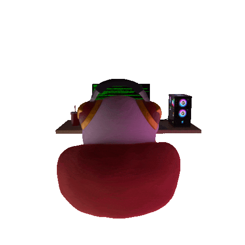

# [Cody Large](https://codylarge.github.io/)
I'm a professional computer user. I enjoy all types of programming but I'm specifically interested in Web development, Game dev and Machine learning.

## More
* 🌍  I'm based in Seattle, Washington
* ✉️  You can contact me at [cdlarge77@gmail.com](mailto:cdlarge77@gmail.com)

## Skills
- Programming
- Web Design
- 3D Modeling/Animation
- Machine Learning
  
## Languages & Tools

    &nbsp;&nbsp;&nbsp;&nbsp;&nbsp;
        &nbsp;&nbsp;&nbsp;&nbsp;&nbsp;
    &nbsp;&nbsp;&nbsp;&nbsp;&nbsp;
    &nbsp;&nbsp;&nbsp;&nbsp;&nbsp;
    &nbsp;&nbsp;&nbsp;&nbsp;&nbsp;
    &nbsp;&nbsp;&nbsp;&nbsp;&nbsp;
    &nbsp;&nbsp;&nbsp;&nbsp;&nbsp;
    &nbsp;&nbsp;&nbsp;&nbsp;&nbsp;

## My Projects

## Socials

  &nbsp;&nbsp;&nbsp;&nbsp;&nbsp;
  &nbsp;&nbsp;&nbsp;&nbsp;&nbsp;
  &nbsp;&nbsp;&nbsp;&nbsp;&nbsp;

<!---
codylarge/codylarge is a ✨ special ✨ repository because its `README.md` (this file) appears on your GitHub profile.
You can click the Preview link to take a look at your changes.
--->
